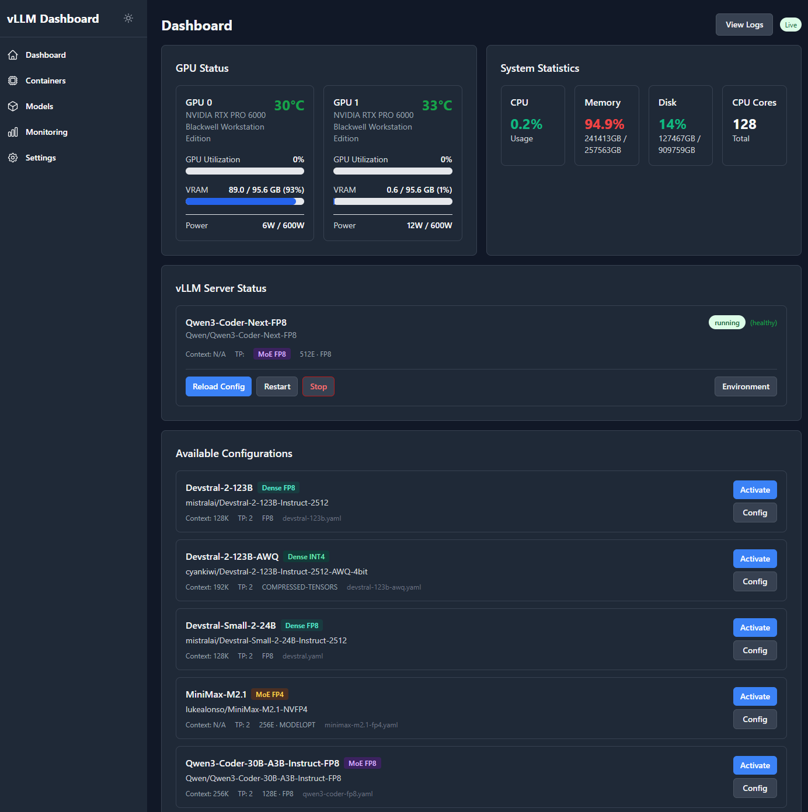
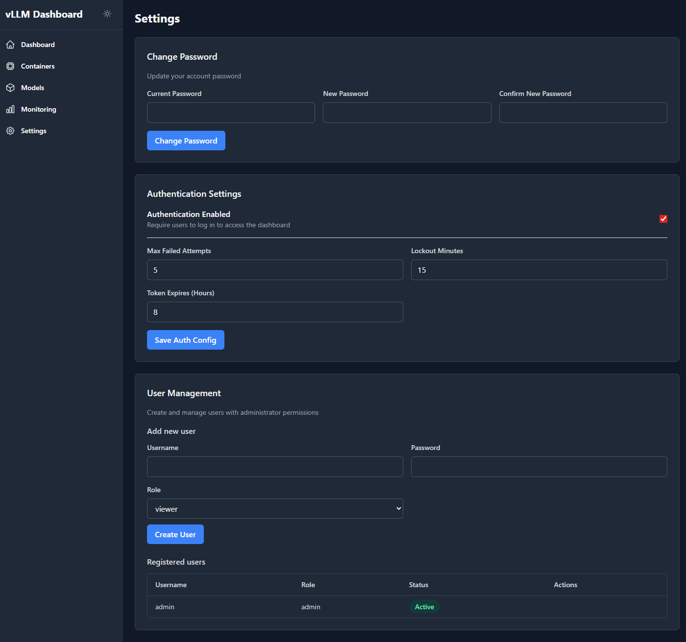
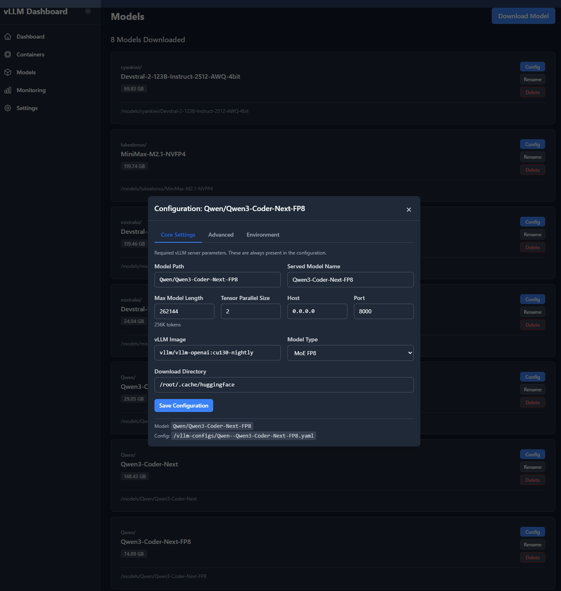
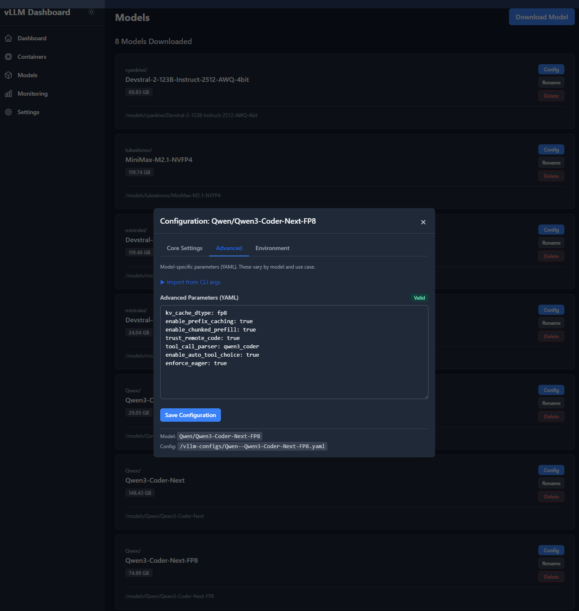
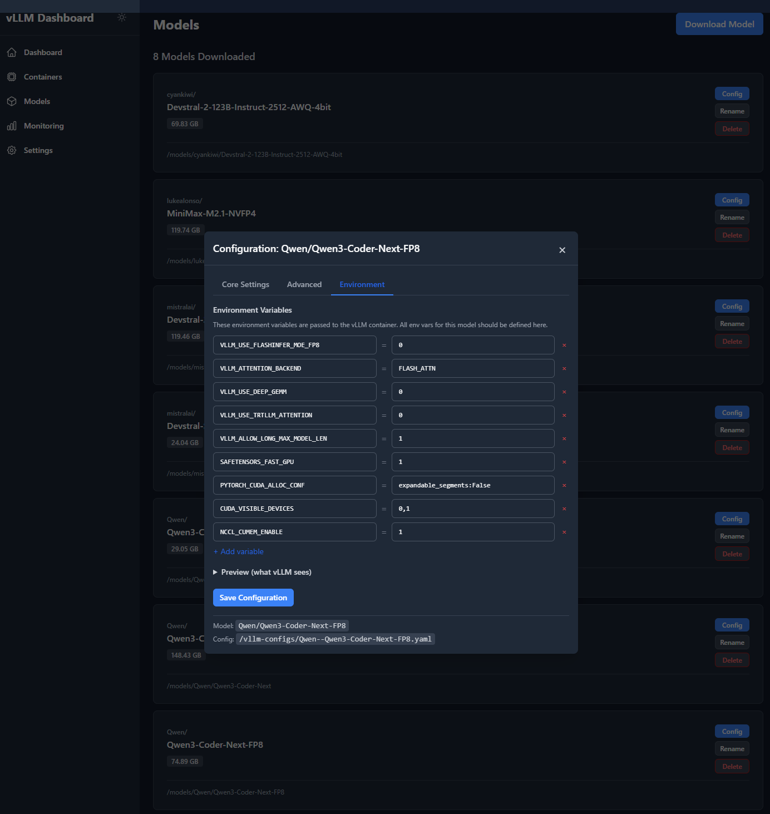
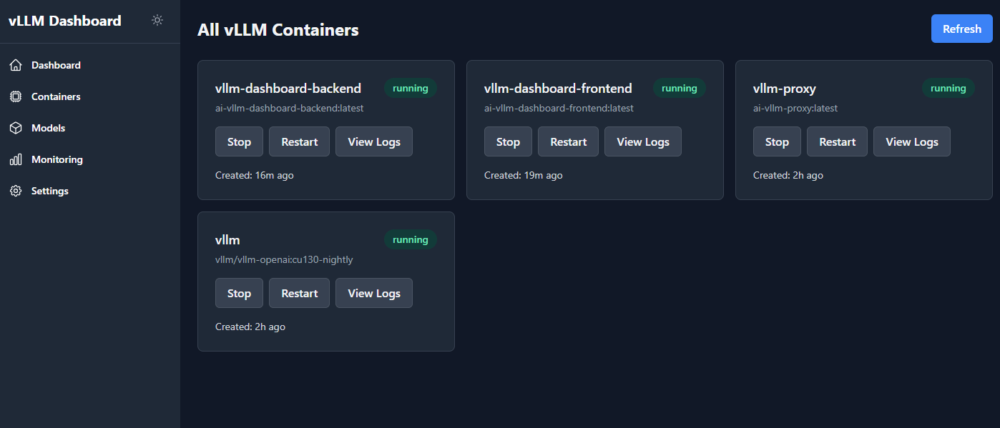

# vLLM Dashboard

Web dashboard for managing [vLLM](https://github.com/vllm-project/vllm) inference servers. Switch models, monitor GPUs, download from HuggingFace—without touching the terminal.

## Features

- **Multi-instance management** — run multiple vLLM instances with independent configs, ports, and GPU assignments
- **Model switching** — one-click activation with container recreation and image pulling
- **Config management** — YAML configs with CLI import, per-model environment overrides
- **Model downloads** — background downloads with progress, resume, and auto-config generation
- **GPU monitoring** — real-time temperature, VRAM, power, utilization via WebSocket
- **Per-instance API keys** — set API keys per instance for security
- **Docker labels** — attach arbitrary labels (Traefik routing, etc.) to SDK-managed containers
- **Port exposure control** — toggle host port mapping per instance
- **User management** — role-based access (viewer, operator, admin) with password change
- **Config regeneration** — regenerate model configs from HuggingFace metadata on demand
- **Dark mode** — system preference detection

## Screenshots

| Dashboard | Settings |
|-----------|----------|
|  |  |

| Core Settings | Advanced Settings | Environment |
|---------------|-------------------|-------------|
|  |  |  |

| Containers |
|------------|
|  |

## Quick Start

**Prerequisites:** Docker with Compose, NVIDIA GPU + drivers, NVIDIA Container Toolkit.

```bash
# Create config directory
mkdir -p configs

# Create a model config
cat > configs/my-model.yaml << 'EOF'
model: mistralai/Devstral-Small-2-24B-Instruct-2512
served_model_name: Devstral-Small
tensor_parallel_size: 2
max_model_len: 131072
trust_remote_code: true
EOF

# Create hardware env file
cat > configs/env.hardware << 'EOF'
TORCH_CUDA_ARCH_LIST=8.9
HF_HUB_ENABLE_HF_TRANSFER=1
EOF

# Build and start
docker compose build && docker compose up -d

# Open http://localhost:8080
```

<details>
<summary>docker-compose.yml</summary>

```yaml
services:
  vllm:
    image: ${VLLM_IMAGE:-vllm/vllm-openai:latest}
    container_name: vllm
    ipc: host
    restart: unless-stopped
    volumes:
      - /path/to/models:/root/.cache/huggingface
      - ./configs:/root/.cache/vllm/configs
    env_file:
      - ./configs/env.active
    environment:
      - VLLM_API_KEY=${VLLM_API_KEY:-local}
      - HUGGING_FACE_HUB_TOKEN=${HUGGING_FACE_HUB_TOKEN:-}
    command: --config /root/.cache/vllm/configs/active.yaml
    deploy:
      resources:
        reservations:
          devices:
            - { driver: nvidia, count: all, capabilities: [gpu] }

  vllm-dashboard-backend:
    build: ./backend
    container_name: vllm-dashboard-backend
    restart: unless-stopped
    environment:
      - VLLM_MODELS_DIR=/models
      - VLLM_CONFIG_DIR=/vllm-configs
      - VLLM_COMPOSE_PATH=/vllm-compose
      - HUGGING_FACE_HUB_TOKEN=${HUGGING_FACE_HUB_TOKEN:-}
      - INITIAL_ADMIN_PASSWORD=${INITIAL_ADMIN_PASSWORD:-}
    volumes:
      - /var/run/docker.sock:/var/run/docker.sock
      - ./:/vllm-compose:ro
      - /path/to/models:/models
      - ./configs:/vllm-configs
    deploy:
      resources:
        reservations:
          devices:
            - { driver: nvidia, count: all, capabilities: [gpu] }

  vllm-dashboard-frontend:
    build: ./frontend
    container_name: vllm-dashboard-frontend
    restart: unless-stopped
    depends_on: [vllm-dashboard-backend]
    ports: ["8080:80"]
```
</details>

## Configuration

### Environment Variables

| Variable | Purpose | Default |
|----------|---------|---------|
| `INITIAL_ADMIN_PASSWORD` | Password for initial admin user | Random (check logs) |
| `WS_ALLOWED_ORIGINS` | WebSocket allowed origins (production) | `http://localhost:8080` |
| `CORS_ORIGINS` | CORS origins for HTTP API | See `main.py` |
| `VLLM_HOST_MODELS_DIR` | Host path to models (for SDK container mounts) | Value of `VLLM_MODELS_DIR` |
| `VLLM_HOST_CONFIG_DIR` | Host path to configs (for SDK container mounts) | Value of `VLLM_CONFIG_DIR` |
| `VLLM_HOST_DATA_DIR` | Host path to vLLM data (for SDK container mounts) | `/mnt/tiny/docker/data/vllm` |

### Multi-Instance

The dashboard supports multiple vLLM instances. Each instance has its own container, port, GPU assignment, and config directory.

- **Default instance** — managed by Docker Compose (`compose.yaml`). Settings like API key, port mapping, GPU IDs, and Traefik labels are defined in `compose.yaml` and `.env`.
- **SDK instances** — created and managed dynamically via the dashboard. All settings are stored in `instances.yaml` and applied when containers are created via Docker SDK.

Instance definitions are stored in `configs/instances.yaml`:

```yaml
instances:
  default:
    display_name: Primary
    container_name: vllm
    port: 8000
    managed_by: compose
    gpu_device_ids: null
  '2':
    display_name: Writing
    container_name: vllm-2
    port: 8002
    managed_by: sdk
    gpu_device_ids: ['1']
    api_key: "my-secret-key"       # passed as --api-key to vLLM
    expose_port: true               # publish port to host
    labels:                          # Docker labels (Traefik, etc.)
      traefik.enable: "true"
      traefik.http.routers.vllm-writing.rule: "Host(`vllm-writing.example.com`)"
```

**SDK instance settings:**

| Field | Purpose |
|-------|---------|
| `api_key` | Per-instance API key (falls back to `VLLM_API_KEY` env var) |
| `expose_port` | Publish the vLLM port to the host (`true`/`false`) |
| `labels` | Arbitrary Docker labels merged onto the container |
| `gpu_device_ids` | List of GPU device IDs to assign |

All three fields can be set at creation or updated later via the Settings page. Changes to `api_key`, `expose_port`, `gpu_device_ids`, and `labels` take effect on the next container restart.

### Model YAML

Standard [vLLM engine args](https://docs.vllm.ai/en/stable/configuration/engine_args/) plus dashboard-specific fields:

```yaml
# vLLM args (passed to engine)
model: Qwen/Qwen3-Coder-30B-A3B-Instruct-FP8
served_model_name: Qwen3-Coder-30B
tensor_parallel_size: 2
max_model_len: 262144

# Dashboard fields (stripped before passing to vLLM)
model_type: moe_fp8                          # See Model Types below
vllm_image: vllm/vllm-openai:latest          # Override compose default
env_vars:                                    # Per-model env overrides
  VLLM_ATTENTION_BACKEND: FLASH_ATTN
```

### Model Types

Auto-detected from HuggingFace `config.json` or set explicitly:

| Type | Architecture | Quantization |
|------|--------------|--------------|
| `dense_full` | Dense | Full precision (FP16/BF16) |
| `dense_fp8` | Dense | FP8 |
| `dense_int8` | Dense | INT8 |
| `dense_int4` | Dense | INT4/AWQ |
| `moe_full` | Mixture of Experts | Full precision |
| `moe_fp8` | Mixture of Experts | FP8 |
| `moe_fp4` | Mixture of Experts | FP4 |

Detection logic reads `num_local_experts`, `quantization_config.quant_method`, and `weights.type`/`num_bits` from the model's `config.json`.

### Environment Layering

On activation, `env.active` is built from layers (later overrides earlier):

```
env.active = env.hardware + env.{model_type} + env_vars
```

| File | Scope |
|------|-------|
| `env.hardware` | All models (NCCL tuning, CUDA arch) |
| `env.{model_type}` | Models of that type |
| `env_vars` in YAML | Single model |

### Tool Call Parsers

| Model Family | Parser |
|--------------|--------|
| Mistral / Devstral | `mistral` |
| Qwen3 Coder | `qwen3_coder` |
| Llama 3.x | `llama3_json` |
| Llama 4 | `llama4` |
| MiniMax M2 | `minimax_m2` |
| Generic | `hermes` |

## Authentication

Default: admin user created on first start. Set `INITIAL_ADMIN_PASSWORD` or check logs for generated password.

**Roles:**
- `viewer` — read-only access
- `operator` — start/stop/switch models
- `admin` — full access including user management

Users can change their own password in Settings.

## How It Works

When you click **Activate**:

1. Dashboard reads model YAML, strips dashboard fields (`model_type`, `vllm_image`, `env_vars`, `port`)
2. Injects the instance's registered port into the config
3. Writes remainder to `active.yaml`
4. Merges env layers into `env.active`
5. For Compose instances: runs `docker compose up -d --force-recreate`
6. For SDK instances: removes old container and creates new one via Docker SDK with the instance's GPU, port, label, and API key settings

**Reload Config** re-reads the YAML and restarts without changing the selected config.

**Model Deletion** removes the model directory, associated config YAMLs, and HuggingFace cache entries.

## API

<details>
<summary>Endpoints</summary>

**Instances**

| Method | Endpoint | Description |
|--------|----------|-------------|
| GET | `/api/instances` | List all instances with status |
| GET | `/api/instances/{id}` | Get single instance |
| POST | `/api/instances` | Create SDK instance |
| PUT | `/api/instances/{id}` | Update instance settings |
| DELETE | `/api/instances/{id}` | Delete instance + containers |

**vLLM** (instance-scoped)

| Method | Endpoint | Description |
|--------|----------|-------------|
| GET | `/api/vllm/{id}/configs` | List configurations |
| GET | `/api/vllm/{id}/active` | Active configuration |
| POST | `/api/vllm/{id}/switch` | Activate a config |
| POST | `/api/vllm/{id}/reload` | Reload active config |
| GET | `/api/vllm/{id}/status` | Container status |
| POST | `/api/vllm/{id}/start` `/stop` `/restart` | Container lifecycle |
| POST | `/api/vllm/{id}/update-image` | Pull latest vLLM image |

**Config** (instance-scoped)

| Method | Endpoint | Description |
|--------|----------|-------------|
| GET | `/api/config/{id}/model/{name}` | Get model config |
| POST | `/api/config/{id}/save` | Save model config |
| POST | `/api/config/{id}/regenerate` | Regenerate config from model metadata |

**Models**

| Method | Endpoint | Description |
|--------|----------|-------------|
| GET | `/api/models/available` | Downloaded models |
| POST | `/api/models/download` | Start download |
| DELETE | `/api/models/{path}` | Delete model + config |
| GET | `/api/models/validate/{name}` | Check HuggingFace |

**Auth**

| Method | Endpoint | Description |
|--------|----------|-------------|
| POST | `/api/auth/login` | Login |
| POST | `/api/auth/logout` | Logout |
| POST | `/api/auth/password` | Change password |
| GET | `/api/auth/users` | List users (admin) |
| POST | `/api/auth/users` | Create user (admin) |

**WebSocket:** `/ws/updates` — GPU metrics, system stats, container status (2s interval).

</details>

## Project Structure

```
backend/
  api/           Route handlers (instances, vllm, config, models, auth, containers)
  services/      VLLMService, ConfigService, HuggingFaceService,
                 DockerService, GPUService, DownloadManager, AuthService,
                 InstanceRegistry
  main.py        FastAPI app
frontend/
  src/components/  React components (ConfigSwitcher, InstanceSelector, etc.)
  src/contexts/    InstanceContext (multi-instance state)
  src/pages/       Dashboard, Models, Monitoring, Containers, Settings
  nginx.conf       Reverse proxy to backend
```

## Troubleshooting

| Problem | Fix |
|---------|-----|
| Can't start/stop vLLM | Verify `/var/run/docker.sock` mounted and backend has GPU access |
| Config switch succeeds but vLLM doesn't restart | Host paths must be accessible inside backend container |
| Env changes not applied | Docker reads `env_file` at creation. Use dashboard actions (not `docker restart`) |
| GPU metrics not showing | Backend needs GPU access for pynvml |
| Model download stuck | Check `downloads.json`. Interrupted downloads appear as resumable |
| Wrong Docker image | Delete `active.image` to reset to compose default |
| SDK container won't start | Set `VLLM_HOST_MODELS_DIR`, `VLLM_HOST_CONFIG_DIR`, `VLLM_HOST_DATA_DIR` to host paths |
| Rate limit on logs | Read endpoints use a 120/min limit; reduce polling frequency if needed |

## Tech Stack

**Frontend:** React 18 · TypeScript · Tailwind CSS · Vite

**Backend:** Python 3.12 · FastAPI · Docker SDK · pynvml · huggingface-hub

## License

BSD-2-Clause
