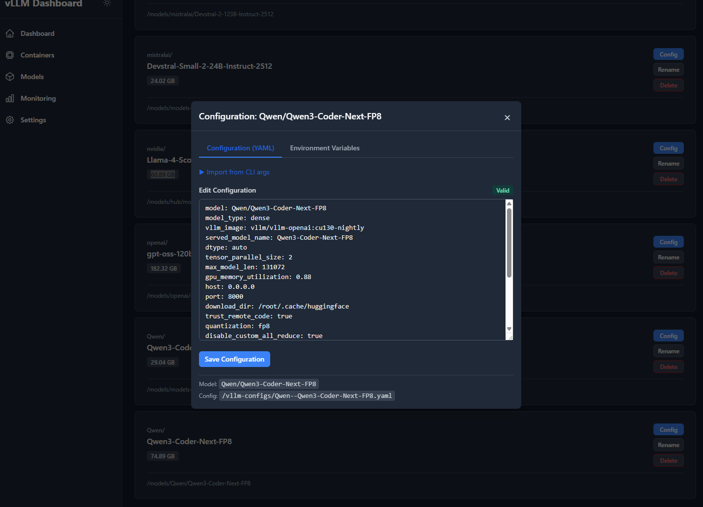
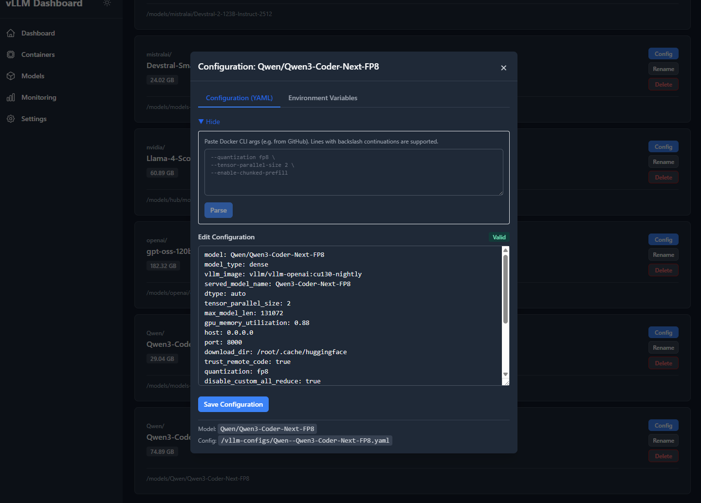
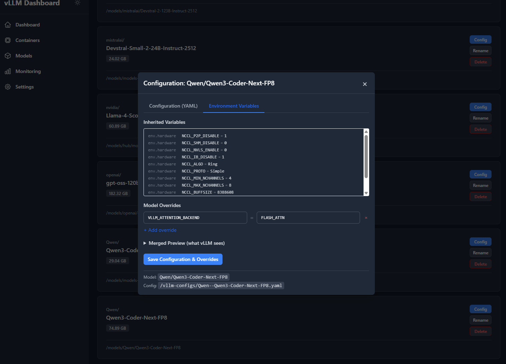
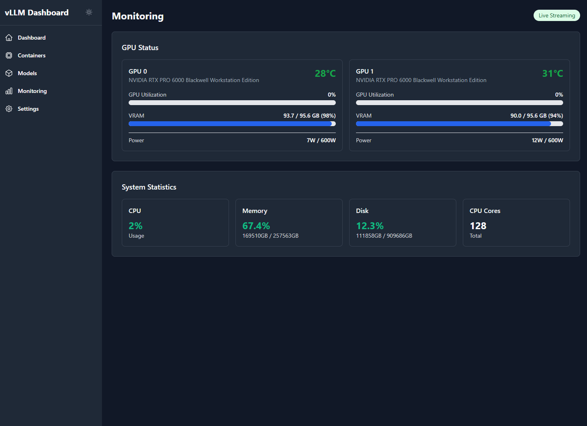
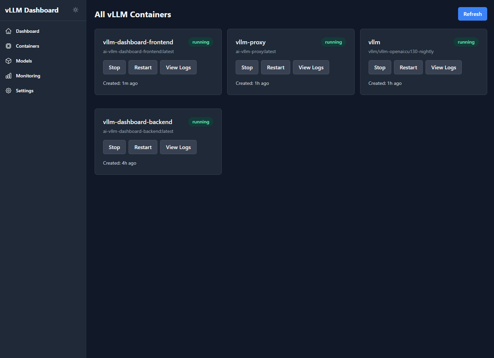

# vLLM Dashboard

A web dashboard for managing [vLLM](https://github.com/vllm-project/vllm) inference servers. Switch models, monitor GPUs, download from HuggingFace, and tune environment variables — without touching the terminal.

## Features

- **One-click model switching** with automatic container recreation and image pulling
- **Per-model config files** combining vLLM args, Docker image, and env var overrides
- **CLI arg import** — paste `docker run` flags from GitHub, auto-convert to YAML
- **Environment variable layering** — hardware → model-type → per-model, with inline editor
- **Model downloads** — background with cancellation, progress, resume, and auto-config generation
- **Real-time GPU monitoring** — temperature, VRAM, power, utilization via WebSocket
- **Dark mode** with system preference detection

## Screenshots

| Dashboard | Config Editor |
|-----------|--------------|
|  |  |

| CLI Import | Environment Variables |
|------------|----------------------|
|  |  |

| Monitoring | Containers |
|------------|------------|
|  |  |

## Quick Start

**Prerequisites:** Docker with Compose, NVIDIA GPU + drivers, NVIDIA Container Toolkit.

```bash
# 1. Create a config directory with a model YAML and env file
mkdir -p configs
cat > configs/my-model.yaml << 'EOF'
model: mistralai/Devstral-Small-2-24B-Instruct-2512
served_model_name: Devstral-Small-2-24B
dtype: bfloat16
tensor_parallel_size: 2
gpu_memory_utilization: 0.90
max_model_len: 131072
enable_chunked_prefill: true
trust_remote_code: true
tool_call_parser: mistral
enable_auto_tool_choice: true
host: 0.0.0.0
port: 8000
EOF

cat > configs/env.hardware << 'EOF'
TORCH_CUDA_ARCH_LIST=8.9
HF_HUB_ENABLE_HF_TRANSFER=1
EOF

# 2. Build and start (see docker-compose.yml below)
docker compose build && docker compose up -d

# 3. Open http://localhost:8080
```

<details>
<summary>docker-compose.yml</summary>

```yaml
services:
  vllm:
    image: ${VLLM_IMAGE:-vllm/vllm-openai:nightly}
    container_name: vllm
    ipc: host
    restart: unless-stopped
    volumes:
      - /path/to/models:/root/.cache/huggingface
      - ./configs:/root/.cache/vllm/configs
    env_file:
      - ./configs/env.active
    environment:
      - VLLM_API_KEY=${VLLM_API_KEY:-local}
      - HUGGING_FACE_HUB_TOKEN=${HUGGING_FACE_HUB_TOKEN:-}
    command: --config /root/.cache/vllm/configs/active.yaml --api-key ${VLLM_API_KEY:-local}
    deploy:
      resources:
        reservations:
          devices:
            - { driver: nvidia, count: all, capabilities: [gpu] }

  vllm-dashboard-backend:
    build: ./backend
    container_name: vllm-dashboard-backend
    restart: unless-stopped
    environment:
      - VLLM_MODELS_DIR=/models
      - VLLM_CONFIG_DIR=/vllm-configs
      - VLLM_COMPOSE_PATH=/vllm-compose
      - HUGGING_FACE_HUB_TOKEN=${HUGGING_FACE_HUB_TOKEN:-}
    volumes:
      - /var/run/docker.sock:/var/run/docker.sock
      - ./:/vllm-compose:ro
      - /path/to/models:/models
      - ./configs:/vllm-configs
    deploy:
      resources:
        reservations:
          devices:
            - { driver: nvidia, count: all, capabilities: [gpu] }

  vllm-dashboard-frontend:
    build: ./frontend
    container_name: vllm-dashboard-frontend
    restart: unless-stopped
    depends_on: [vllm-dashboard-backend]
    ports: ["8080:80"]
```
</details>

## Configuration

### Model YAML

Each config file has standard [vLLM engine args](https://docs.vllm.ai/en/stable/configuration/engine_args/) plus three optional dashboard fields:

```yaml
# vLLM args (any key from --help, written to active.yaml)
model: Qwen/Qwen3-Coder-30B-A3B-Instruct-FP8
served_model_name: Qwen3-Coder-30B
tensor_parallel_size: 2
max_model_len: 262144
# ...

# Dashboard fields (stripped before passing to vLLM)
model_type: moe_fp8                          # dense | moe_fp8 | moe_fp4
vllm_image: vllm/vllm-openai:cu130-nightly  # overrides compose default
env_overrides:                               # per-model env vars
  VLLM_ATTENTION_BACKEND: FLASH_ATTN
```

| Field | Purpose | Default |
|-------|---------|---------|
| `model_type` | Selects env file layer (`env.dense`, `env.moe-fp8`, `env.moe-fp4`) | Auto-detected |
| `vllm_image` | Docker image for the vLLM container | Compose default |
| `env_overrides` | Env var overrides, merged last (highest priority) | None |

### Environment Layering

On activation, `env.active` is built from three layers (later overrides earlier):

```
env.active = env.hardware + env.{model_type} + env_overrides
```

| File | Scope |
|------|-------|
| `env.hardware` | All models — NCCL tuning, CUDA arch |
| `env.moe-fp8` / `env.moe-fp4` / `env.dense` | All models of that type |
| `env_overrides` in model YAML | Single model |

### Tool Call Parsers

| Model Family | Parser |
|---|---|
| Mistral / Devstral | `mistral` |
| Qwen3 Coder | `qwen3_coder` |
| Llama 3.x | `llama3_json` |
| Llama 4 | `llama4` |
| MiniMax M2 | `minimax_m2` |
| Generic | `hermes` |

## How It Works

When you click **Activate**:

1. Dashboard strips `model_type`, `vllm_image`, `env_overrides` from the YAML
2. Writes the remainder to `active.yaml`
3. Merges env layers into `env.active`
4. Runs `docker compose up -d --force-recreate --pull missing` with the image tag injected

`--force-recreate` is required because Docker only reads `env_file` at container creation time.

## API

<details>
<summary>Endpoints</summary>

**vLLM**

| Method | Endpoint | Description |
|--------|----------|-------------|
| GET | `/api/vllm/configs` | List configurations |
| GET | `/api/vllm/active` | Active configuration |
| POST | `/api/vllm/switch` | Activate a config |
| GET | `/api/vllm/status` | Container status |
| POST | `/api/vllm/start` `/stop` `/restart` | Container lifecycle |
| GET | `/api/vllm/env` | List env files |
| GET/PUT | `/api/vllm/env/{file}` | Read/write env file |
| GET | `/api/vllm/env/preview/{config}` | Preview merged env vars |

**Models**

| Method | Endpoint | Description |
|--------|----------|-------------|
| GET | `/api/models/list` | Downloaded models |
| POST | `/api/models/download` | Start download |
| GET | `/api/models/download/active` | Active downloads |
| POST | `/api/models/download/cancel/{id}` | Cancel |
| POST | `/api/models/download/resume/{id}` | Resume |
| GET | `/api/models/validate/{name}` | Check HuggingFace |
| DELETE | `/api/models/{path}` | Delete model |

**WebSocket:** `/ws/updates` — GPU metrics, system stats, container status (2s).

</details>

## Project Structure

```
backend/
  api/              Route handlers
  services/         VLLMService, ConfigService, DownloadManager,
                    DockerService, GPUService, HuggingFaceService
  main.py           FastAPI app with lifespan
frontend/
  src/components/   React components (config editor, GPU monitor, etc.)
  src/pages/        Dashboard, Models, Monitoring, Containers, Settings
  src/services/     Shared axios instance
  nginx.conf        Reverse proxy to backend
```

## Troubleshooting

| Problem | Fix |
|---------|-----|
| vLLM hangs on multi-GPU startup | Set `NCCL_P2P_DISABLE=1` in `env.hardware` (common on PCIe without NVLink) |
| FlashInfer MoE kernel error | Set `model_type: dense` to bypass incompatible MoE kernels |
| Blackwell SM120 kernel errors | Use `vllm_image: vllm/vllm-openai:cu130-nightly` |
| Wrong image on restart | Clear `active.image` to fall back to compose default |
| Dashboard can't recreate containers | Mount Docker socket and ensure host paths are accessible |

## Tech Stack

**Frontend:** React 18 · TypeScript · Tailwind CSS · Vite
**Backend:** Python 3.12 · FastAPI · Docker SDK · pynvml · huggingface-hub

## License

BSD-2-Clause
